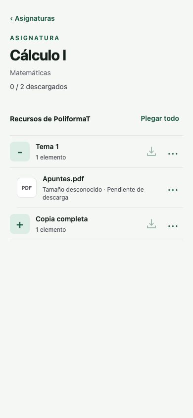
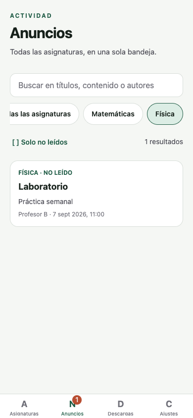
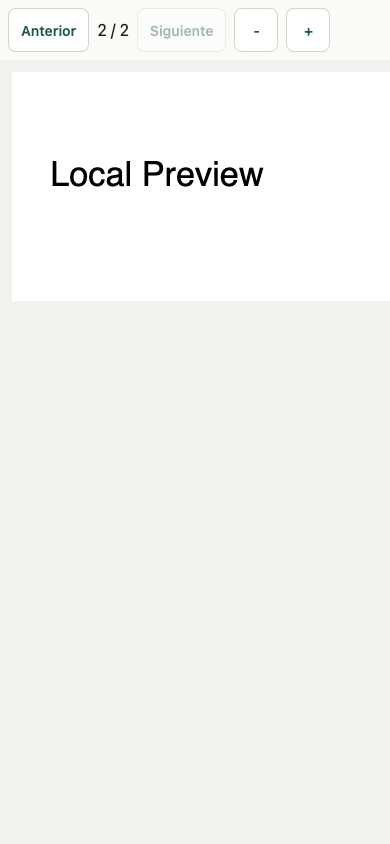
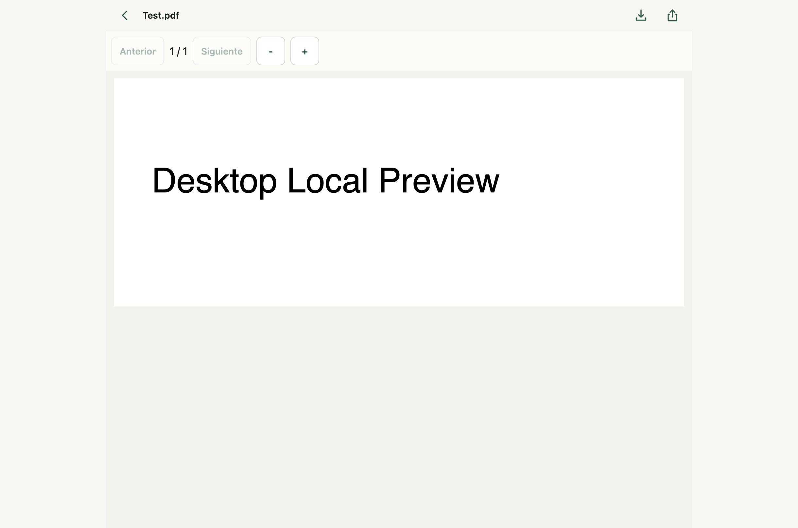

# Sakai Client

Independent, unofficial client for the Sakai learning platform, currently configured to connect to UPV's PoliformaT installation. It provides access to course resources and announcements and downloads selected documents only when requested by the user.

> **Not an official university application.** This project and its maintainer(s) are not affiliated with, sponsored by, endorsed by, or acting on behalf of the Universitat Politècnica de València (UPV), PoliformaT, the Sakai project, or the Apereo Foundation. References to those names identify compatible services and technologies only.

## Features

- Sakai EntityBroker login with the institutional portal/CAS flow when direct login is rejected. Course and announcement providers require the user's authorized session; they are not anonymous public data.
- Recursive resource discovery combining EntityBroker and WebDAV results requested in parallel.
- Explicit downloads by file, folder subtree, course, or the entire library, with byte progress, cancellation, a 30-second per-file timeout, incremental reuse, validation and interrupted replacement recovery.
- One directory per course, retaining the remote folder hierarchy. Download counts and file ticks require a physically available local file; folder completion additionally requires current manifest metadata. The app rechecks existence at startup, foregrounding and relevant screen focus.
- Expo Router tabs for courses, announcements, downloads and settings; persistent course aliases, favorites and manual ordering; and a searchable cross-course announcement inbox with local course/unread filters and full-text details.
- Tapping a resource checks for a local file, downloads that file if missing, then opens it. An existing copy is reused; use the viewer's download action to force an update.
- The visible actions button, or a long press, opens resource quick actions: open, download or update, share the original, and delete the local copies of that file or subtree after confirmation. Deletion is local only; nothing is removed from PoliformaT.
- Local native PDF rendering on iOS/Android through `react-native-pdf`, bundled PDF.js on desktop, and simplified read-only DOCX, ODT, PPTX, TXT, MD and CSV previews.
- A full Electron desktop client with restricted IPC, streaming file operations and OS-encrypted credentials where available. Ordinary browsers are read-only import viewers.
- Opt-in local announcement and download-completion notifications, offline indexes and JSON exports without authentication secrets. Exports can still contain personal and copyrighted content.

## Screenshots

All screenshots use synthetic fixture data. They contain no real university account, credentials, course material or announcement content.

| Course resources | Announcement inbox | Local PDF reader |
| :---: | :---: | :---: |
|  |  |  |

The views above are 390 px responsive browser fixtures. They validate the shared interface, but are not screenshots from a physical iOS or Android device.

<p align="center">
  
  <br>
  <sub>Electron desktop shell displaying a downloaded PDF through the local bundled reader.</sub>
</p>

## Documentation

- [Installation](INSTALL.md): release assets, checksum verification, OS trust prompts, mobile signing and platform-specific troubleshooting.
- [Usage](docs/USAGE.md): first launch, downloads, readers, announcements and troubleshooting.
- [Storage and privacy](docs/STORAGE-PRIVACY.md): folder relocation, cancellation, recovery, credentials, exports and account switching.
- [Development](docs/DEVELOPMENT.md): prerequisites, package scripts, native builds and generated assets.
- [Desktop integration](desktop/INTEGRATION.md): IPC contract, security boundaries and packaging.
- [CI and releases](.github/CI.md): triggers, toolchains, outputs and publication rules.
- [Unsigned release notice](.github/UNSIGNED-RELEASE.md): installation and signing limitations.
- [Validation record](docs/VALIDATION.md): historical evidence, current audit status and untested platforms.

## Local directory layout

Choose the default application folder or a folder through the system picker on first launch. This screen returns only when the choice has not been confirmed, or after import/clear-index resets it, not merely because a provider is temporarily inaccessible. The choice can be changed in Downloads. External iOS folders may require authorization again after restarting; persistent bookmarks are not promised.

```text
Selected directory (or Sakai Sync)/
├── Course A/
│   ├── Topic 1/
│   │   ├── notes.pdf
│   │   └── exercises.docx
│   └── Slides/
│       └── week-02.pptx
└── Course B/
    └── Resources/
        └── dataset.zip
```

Remote path separators are retained. Invalid filename characters are sanitized, reserved names are adjusted, and duplicate sanitized course titles receive a short site ID suffix. Course-title comparisons and full sanitized destination paths account for case-insensitive filesystems; colliding document names receive stable suffixes instead of replacing one another. This is a filesystem-safe layout, not a byte-for-byte mirror of remote names.

Ordinary downloads are one-way: they never upload edits or prune files removed from the remote listing, but an explicit update can replace an older local copy. Folder relocation is different: it copies and verifies all available sources, persists all updated document URIs and the selected root together, then removes verified originals. Nested source/destination roots are rejected; selecting the same root is a no-op for files.

Cancellation or failure before the index commit keeps the old index/root and originals; verified destination copies may remain for reuse. Cancellation or failure during cleanup leaves remaining originals alongside the committed copies. Unrelated destination files are not overwritten during relocation, and old empty directories are not removed. This is **not a fully atomic filesystem operation**: external providers, forced termination or power loss may require [manual recovery](docs/STORAGE-PRIVACY.md#recovery).

## Platform behavior

| Platform | Sakai access | Files | Background work |
| --- | --- | --- | --- |
| Android | Full | App-private `Sakai Sync` by default, or system-selected directory | Opt-in announcement checks; requested minimum 60 minutes, OS-controlled |
| iOS / iPadOS | Full | App `Documents/Sakai Sync`, visible in Files, or system-selected directory | Opt-in announcement checks; requested minimum 60 minutes, OS-controlled |
| Windows / macOS / Linux | Full, through a restricted Electron main-process bridge | `Documents/Sakai Client` or a user-selected folder | Configured metadata refresh every 15 minutes while open |
| Web | Imported data only | Indexes, not another device's file bytes | Not available |

PoliformaT currently allows CORS only for a specific UPV origin, so an independently hosted Expo web app cannot read authenticated REST responses. The web build is therefore a local viewer and does not store credentials.

Documents are never downloaded automatically, including after migrating version-1 data. Opening the app or returning to it can refresh metadata and verify whether indexed local files still exist, not fetch file contents. The native background task only fetches announcements and notifies; it does not overwrite `AppData`. Scheduled checks require notification opt-in and remembered credentials in the current application flow. These are local notifications, not institutional push notifications. Requested downloads can issue an opt-in completion alert. Completed downloads are kept if an ordinary batch is cancelled.

The Office/text and PDF.js readers have a 32 MiB input limit and additional text/archive limits. Native PDF rendering does not transfer the entire file through JavaScript; Android provider URIs may need a temporary local filesystem copy. Office previews omit images, formulas and exact layout. Open/share the original for full fidelity. PDF.js and its support assets are bundled, not loaded from a CDN or conversion service. An ordinary browser cannot read document bytes from exported mobile or desktop URIs.

## Quick Start

Use Bun 1.3.14 and Node.js 24 to match CI. The app uses Expo SDK 57, React Native 0.86, React 19, Expo Router, TypeScript and NativeWind. Install dependencies on a fresh checkout or when the lockfile changes:

```bash
bun install --frozen-lockfile
bun run start
```

`start` runs Metro; it does not build or install the native app. **Expo Go cannot run this app's native PDF module.** Use a native build. See [development prerequisites and scripts](docs/DEVELOPMENT.md) before running platform commands.

`start`, `typecheck` and the application build scripts generate the ignored PDF support module. Before invoking Expo CLI directly, run `bun run pdf:assets`. Native directories are generated and ignored; configure native behavior in `app.json`, `app.config.ts` and plugins, not by manually editing `ios/` or `android/`.

```bash
bun run android
bun run web
```

Desktop launch and unpacked packaging:

```bash
bun run desktop
bun run build:web
node desktop/build.cjs --dir
```

`desktop` exports web before opening Electron. Packaging requires a fresh `dist/web`; the packaging helper does not rebuild it. There is no desktop HMR. The helper rejects a literal extra `--`, so the direct Node command above avoids argument-forwarding ambiguity. Desktop file/root capabilities are installation-specific; imports from another device can require a new root and downloads. See [desktop integration](desktop/INTEGRATION.md).

`bun run ios` uses a **private external** `FirmadorDeApps` installation to sign a Release app and install it on the configured physical device. `bun run ios:build` creates `dist/ios/SakaiClient-signed.ipa` without installing. These are not generic fresh-clone commands: `IOS_SIGNER_DIR` is required, and `IOS_DEVICE_ID` is also required for installation. No private signing material or device identifier is included in this repository.

The provisioning profile has a fixed App ID. Installing this build can replace another app signed with `app.ursaminor7619.otter1161`.

## GitHub builds and releases

[The workflow](.github/workflows/ci.yml) validates and exports web for pull requests, version tags and manual runs; ordinary branch pushes do not start a workflow. Version tags and manual runs additionally build Android, iOS, Windows x64, Linux x64, and macOS arm64/x64; tags such as `v1.2.3` create a GitHub Release after all required jobs pass. Prerelease tags such as `v1.2.3-beta.1` create prereleases. Existing published releases are not overwritten.

The CI mobile outputs are explicitly **unsigned**: an APK without a signing configuration and an iOS device IPA using `dev.sakaiclient.unofficial`. Neither is directly installable without appropriate signing. Desktop installers are not code-signed or notarized and may trigger OS trust warnings. CI does not use or upload the private signing files from the local Mac. There is no App Store, TestFlight, Play Store or automatic-update deployment in this workflow.

The project is hosted at [teo2peer/SakaiClient](https://github.com/teo2peer/SakaiClient). The current `main` workflow passed validation and produced all documented platform artifacts on GitHub-hosted runners. Review runner usage and CI-minute limits, especially for the macOS matrix. Details, run evidence and artifact names are in [.github/CI.md](.github/CI.md); tagged release assets include SHA-256 checksums.

Standard validation commands; the exact focused checks executed for the current audit are listed in the validation record:

```bash
bun test
bun run lint
bun run typecheck
bunx expo-doctor
```

[Validation evidence and gaps](docs/VALIDATION.md) distinguish earlier successful builds/tests from the current relocation audit. Existing artifacts may predate current source. `reset-project` is a destructive starter reset, **not** a cache-clear command.

## Security

- Authentication secrets use native SecureStore or desktop OS encryption, separately from the ordinary local index. Desktop refuses plaintext secret persistence; without encryption, only an empty in-memory session marker is allowed for the running cookie session.
- Disabling remembered credentials prevents unattended session renewal. The ordinary browser stores no application login credentials.
- Signing out clears stored authentication but keeps indexes and files. Clearing the local index does not delete files or sign out.
- There is **no per-account data partition**. Switching accounts does not wipe the previous account's local data.
- Exports contain indexes, announcement content and local URIs, not document bytes or authentication secrets. Credential-free does not mean anonymous or safe to publish. See [storage and privacy](docs/STORAGE-PRIVACY.md).

## Legal notice

### Independent project

Sakai Client is a separate software project. It is not an official UPV service, an official Sakai release, or a university communication channel. Its maintainers do not represent the institution or the upstream projects. The names, trademarks and any third-party branding remain the property of their respective owners; this repository grants no rights to use that branding.

### Authorized access and use

Use the client only with an account and resources you are authorized to access. Having the source code or the ability to download a file does not grant permission to access, reuse or redistribute it. Follow the institution's current service terms, acceptable-use rules, account policies and applicable law, including any restrictions on automated access or local copies. Do not use this software to circumvent authentication, permissions, technical restrictions or account limits.

### Academic content and third-party rights

Course documents, announcements, attachments, personal information and other material obtained from an institution are not supplied or licensed by this project. Rights remain with their authors and other applicable rights holders. The software licence does not extend to that material. Downloading a resource does not authorize publishing it, sharing it with others, removing notices or retaining it beyond the permissions you have. Do not commit credentials, protected course content or private exports to this repository.

### Privacy and local copies

Authentication and resource requests go directly to the configured institutional services, not through a maintainer-operated proxy. The integrated readers process documents locally. Explicit sharing actions can send a file to another application or recipient chosen by the user, whose own terms and privacy practices then apply.

Downloaded files, notification previews and exported indexes can contain personal, confidential or copyrighted information. An export may include announcement bodies, authors, course names and local file paths even though access credentials are excluded. Protect the device and its backups, review operating-system sharing settings, and share or publish data only when you have permission. These implementation notes are not a complete privacy policy or a claim of regulatory compliance.

### Reliability, warranty and responsibility

The official institutional platform remains the authoritative source for announcements, deadlines, grades and other academic information. Cached data may be outdated, notifications may be delayed or absent, and document previews may omit formatting or content. Check the original source before making decisions that depend on accuracy or timeliness. The client does not guarantee compatibility, uninterrupted service, preservation of every file, or any academic outcome.

The software is provided under [LICENSE](LICENSE), together with the applicable licences of its third-party dependencies. The warranty and liability limitations in that licence apply only to the extent permitted by applicable law. Nothing in this README excludes liability, rights or duties that cannot lawfully be excluded, or grants immunity for unlawful conduct.

### Questions or concerns

Direct concerns about code or assets distributed in this repository to its maintainer through an available private contact channel. Do not include passwords, session tokens, personal records or protected course materials in a public report. Access, account and institutional-content questions should be directed to the institution through its official channels.

This notice explains the project's independent status and intended use; it is not legal advice or a substitute for a jurisdiction-specific review. Publishing or distributing the application may require additional review of service terms, intellectual-property rights, privacy obligations and distribution requirements.
